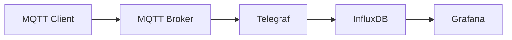

# IoT Training Project by [devminds GmbH](https://devminds.ch)

This project is used for trainings offered by devminds GmbH.

**WARNING:** this project is only used for local lab setups, do NOT use anything from this project for production deployments!!!

The project contains configuration files to setup a simple IoT toolchain:

* [paho-mqtt](https://eclipse.dev/paho/files/paho.mqtt.python/html/index.html) as MQTT client
* [eclipse-mosquitto](https://mosquitto.org/) as MQTT broker
* [telegraf](https://www.influxdata.com/time-series-platform/telegraf/) as MQTT to InfluxDB bridge
* [InfluxDB](https://www.influxdata.com/products/influxdb/) as time series database
* [Grafana](https://grafana.com/) for dashboard visualizations

## Secrets and credentials

* Create a local `.env` file from the template: `cp .env.example .env`
* Edit `.env` and replace secrets with strong values!
