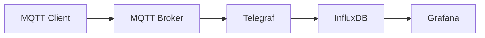

# IoT Training Project by [devminds GmbH](https://devminds.ch)

This project is used for trainings offered by devminds GmbH.

**WARNING:** this project is only used for local lab setups, do NOT use anything from this project for production deployments!!!

The project contains configuration files to setup a simple IoT toolchain:

* [paho-mqtt](https://eclipse.dev/paho/files/paho.mqtt.python/html/index.html) as MQTT client
* [eclipse-mosquitto](https://mosquitto.org/) as MQTT broker
* [Telegraf](https://www.influxdata.com/time-series-platform/telegraf) as MQTT to InfluxDB bridge
  * [Telegraf Deployment Strategies with Docker Compose](https://www.influxdata.com/blog/telegraf-deployment-strategies-docker-compose)
  * [Storing Secrets with Telegraf](https://www.influxdata.com/blog/storing-secrets-telegraf)
* [InfluxDB](https://www.influxdata.com/products/influxdb) as time series database
  * [Install InfluxDB using Docker Compose](https://docs.influxdata.com/influxdb/v2/install/use-docker-compose)
* [Grafana](https://grafana.com) for dashboard visualizations
  * [Configure a Grafana Docker Image](https://grafana.com/docs/grafana/latest/setup-grafana/configure-docker)
